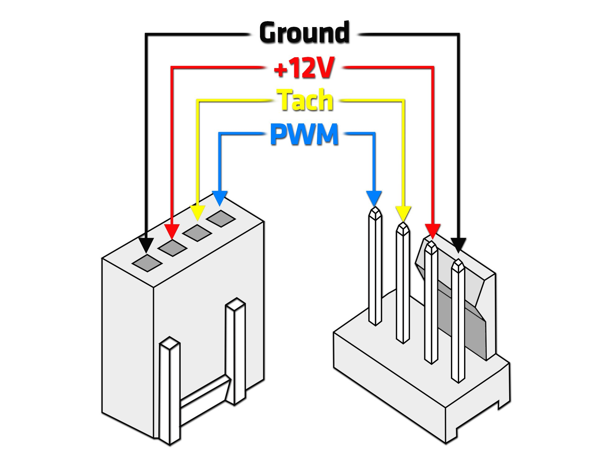
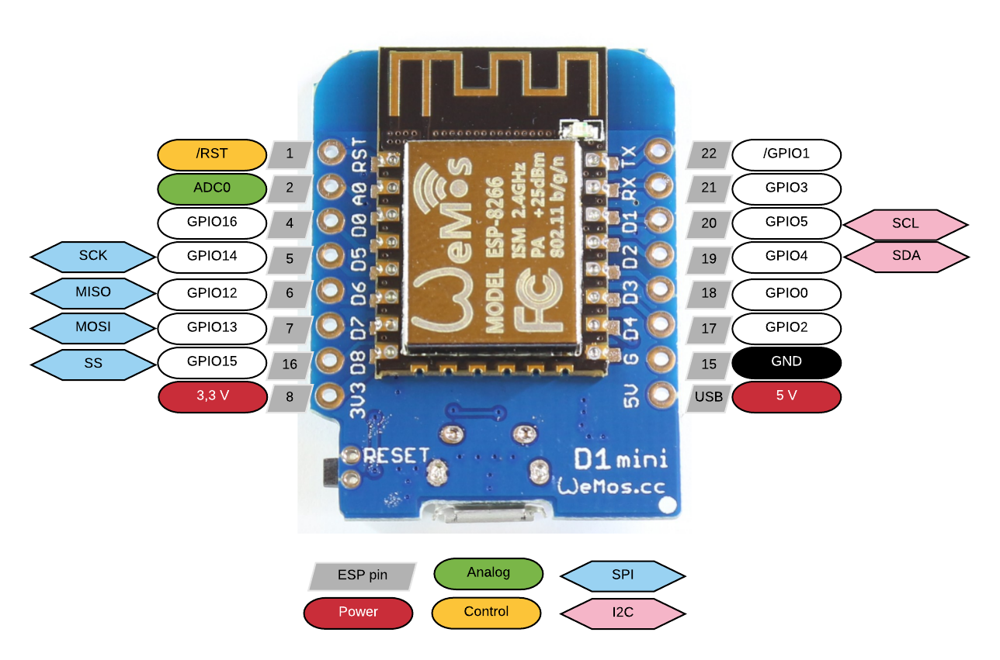
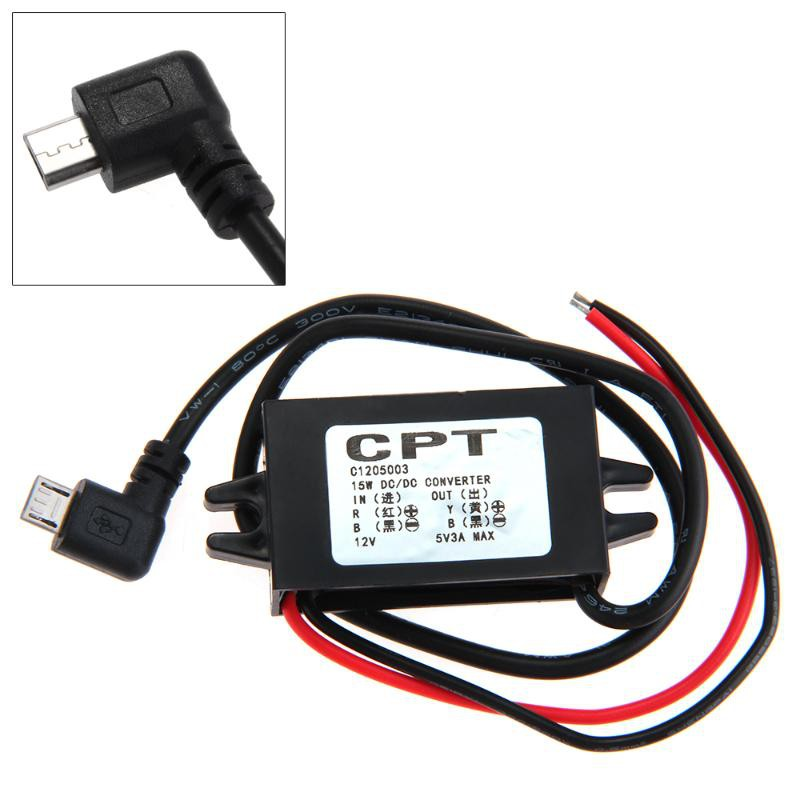
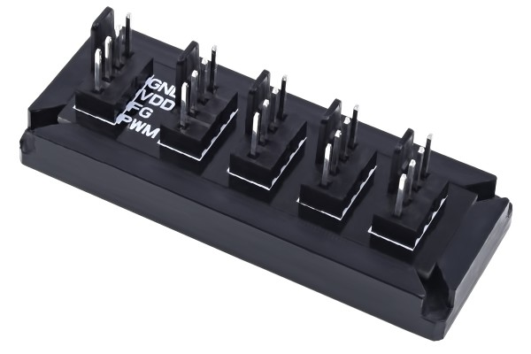

# ESPHOME PWM FAN CONTROLLER

## Hardware

- esp8266 (D1 Mini for example )
- relay (required to turn off fan)
- PWM (4 PIN) Fan
- 12v power supply

## Connection

| 12v PS | ESP | Relay         | FAN           |
| ------ | --- | ------------- | ------------- |
|        | 5v  | Relay DC +    |               |
|        | GND | Relay DC -    |               |
|        | D1  | Relay Data In |               |
| 12V    |     | IN            |               |
|        |     | OUT           | 12v (red)     |
| GND    |     |               | GND (black)   |
|        | D3  |               | Tach (yellow) |
|        | D4  |               | PWM (blue)    |

## Fan Connection

## D1 Mini Pinout

## Recommendations

### 12v to 5v

You can use a 12v to 5v Mini USB to power the D1 Mini and the fans at the same time

### Fan Connector Splitter

You can control more that one fan with one system using somthing like this

### Powe Supply size

Take into consideration the number of fans that the power supply will feed!

Use this values only as reference, always consult your fan specs:

| fan    | rpm      | watt  | amp      |
| ------ | -------- | ----- | -------- |
| 80 mm  | 2000 rpm | 1.8 w | 0.15 Amp |
| 120 mm | 2000 rpm | 6 w   | 0.5 Amp  |
